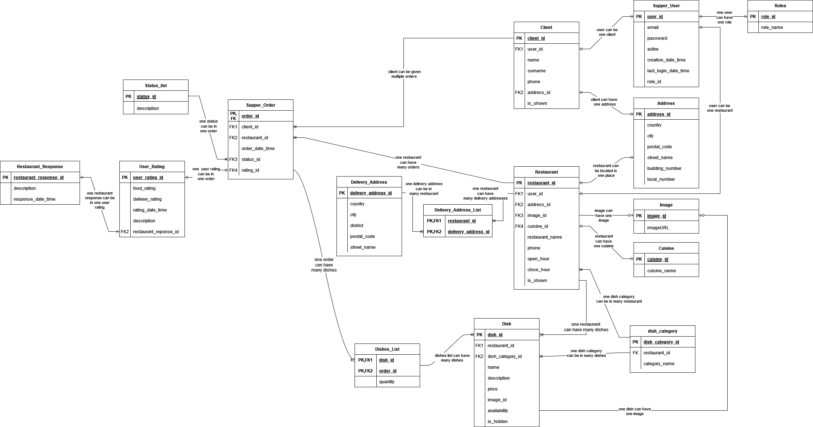

# Supper Speed

Supper Speed my beginner project designed mimic the JustEat website. This application allows users to register with
roles of either CLIENT or RESTAURANT. Restaurants can add dishes and dish categories, while clients can order dishes.
Users have the ability to update their personal information, such as name, surname, address, and phone number.
Additionally, the project supports order status checking and processing.

## Features

- **User Registration and Authentication**: Users can register and log in with roles of CLIENT or RESTAURANT.
- **User Profile Management**: Users can update their personal information including name, surname, address, and phone
  number.
- **Restaurant Features**: Restaurants can add new dishes and dish categories.
- **Client Features**: Clients can browse dishes and place orders.
- **Order Management**: Users can check the status of their orders and proceed with the order processing.

- **SwaggerUI**

## Getting Started

### Prerequisites

- Java 11 or higher
- Maven or Gradle
- PostgreSQL database

### Installation

1. **Clone the repository**:
    ```bash
    git clone https://github.com/yourusername/supper-speed.git
    cd supper-speed
    ```

2. **Configure the database**:
    - Create a PostgreSQL database.
    - Update the database configuration in `application.properties` file.

3. **Build the project**:
    ```bash
    ./gradlew build
    ```

4. **Run the application**:
    ```bash
    ./gradlew bootRun
    ```

### Dependencies

The project uses several dependencies to facilitate development, including Spring Boot for backend development and
Thymeleaf for server-side rendering. Below is a list of the main dependencies used in the project:

#### Spring Boot

- `spring-boot-starter-data-jpa`
- `spring-boot-starter-thymeleaf`
- `spring-boot-starter-validation`
- `spring-boot-starter-web`
- `spring-boot-starter-webflux`
- `spring-boot-starter-security`
- `spring-boot-starter-oauth2-client`
- `thymeleaf-extras-springsecurity6`

#### Image Processing

- `imgscalr-lib`

#### Database

- `flyway-core`
- `postgresql`

#### Annotations and Code Generation

- `lombok`
- `mapstruct`

#### Testing

- `spring-boot-starter-test`
- `spring-boot-testcontainers`
- `spring-security-test`
- `junit-jupiter`
- `testcontainers`
- `wiremock-standalone`
- `rest-assured`

## Usage

1. **Register as a User**:
    - Visit the registration page and sign up as either a CLIENT or a RESTAURANT.

2. **Log in**:
    - Use your credentials to log in to the application.

3. **Manage Profile**:
    - Navigate to the profile section to update your personal information.

4. **For Restaurants**:
    - Add new dishes and categories through the restaurant dashboard.

5. **For Clients**:
    - Browse available dishes and place orders.

6. **Order Management**:
    - Check the status of your orders and proceed with order processing as required.

## Use cases with existing test Data
1. **Overview**:
   - 4 test users exist: 
     - user1@user.com, user2@user.com, user3@user.com - as restaurant
     - user4@user.com - as client
   - test users share the same password: test
   - if you want to see restaurant's or client's profile it is recommended to log in as user3 or user 4 (have the biggest amount of data added)

2. **Main Page**:
   - Field "city" contains cities with registered restaurants.
   - In the main page your provide your address. Pressing "Show Restaurants" button redirects you to page with listed restaurants which deliver to you address.
     - Choose data: City - Lublin, Street Name - Jaskrawa1, Cuisine: All - and you'll see single restaurant with name restaurant3.
     - Choose data: City - Lublin, Street Name - Jaskrawa2, Cuisine: All - and you'll see two restaurants with name restaurant2 and restaurant3.
   - Now you can browse restaurant's menu or opinions about restaurant.
   - Restaurants can be sorted (asc or desc)

3. **Restaurant Profile**:
   - Allows you to change restaurant data and restaurant address.
   - Restaurant can only be found when it has IsShown parameter set to true (if yellow button "hide my restaurant" is present it means that your restaurant can be found)

4. **Restaurant Menu**:
   - Allows you to new/update/delete dish categories and dishes.
   - Allows to add dish photo
   - only one dish/category can be updated in the single request.

5. **Restaurant Delivery Addresses**:
   - Shows the delivery addresses for restaurant. Data is paginated and can be sorted (asc or desc)
   - You can add delivery address existing in the database to your pool of delivery addresses (must be added before)
   - You can add your own delivery address to the database. It is automatically assigned to your pool (other restaurant will see address you have added)

6. **View Orders**:
   - shows all your orders
   - order can be cancelled by the client when orders status is equal to NEW or PAID unless 20 minutes has passed
   - order can be cancelled by the restaurant when orders status is equal to NEW, PAID, ACCEPTED or DELIVERY unless 20 minutes has passed
   - client can comment on realized orders
   - restaurant can add their own response to client comment
   - comments cannot be edited!


## Entity Relationship Diagram (ERD)

Below is the Entity Relationship Diagram (ERD) of the project to help you understand the database structure and
relationships between different entities.



## Contributing

Sorry, but contributions are not needed. Feel free to pull this project, and do the changes yourself.

## Contact

If you have any questions, please open an issue on GitHub

---

Happy coding!
